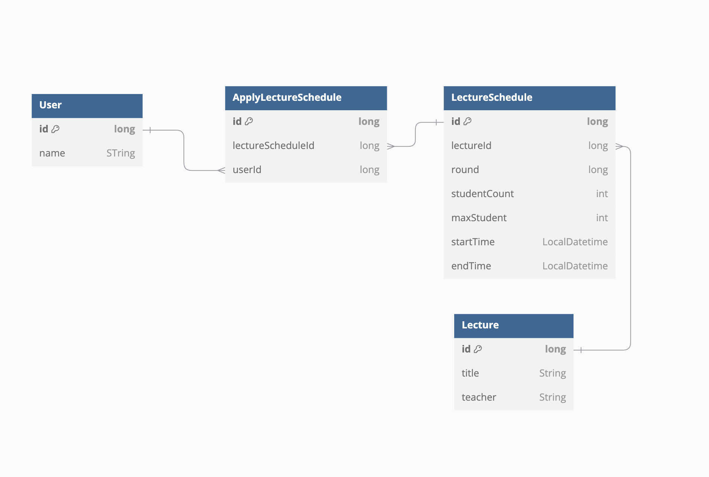

# ERD 설계 보고서
> **P.S.** 과제를 진행하면서 저의 고민하고 생각하는 과정을 기록하고 싶어 중간중간 보고서 형식의 말투가 아닌 부분이 있습니다... 귀엽게 봐주시면 정말 감사하겠습니다!! 😊

## 1. ERD 개요

- **User**: 사용자 정보를 저장하는 테이블.
- **Lecture**: 특강 정보(강사,특강이름 등)를 저장하는 테이블.
- **LectureSchedule**: 특강 일정(날짜 및 시간 , 수강인원)을 관리하는 테이블.
- **ApplyLectureSchedule**: 사용자와 특강 일정 간의 신청 정보를 저장하는 테이블.

---

## 2. 테이블 설명

### 2.1 User
- **목적**: 사용자 정보를 저장합니다.
- **필드 간단 설명**:
    - `id` (Primary Key): 사용자 고유 식별자.
    - `name`: 사용자 이름.
- User는 이번과제에서는 id위주로만 사용 되기 때문에 간단히 작성
### 2.2 Lecture
- **목적**: 특강 정보를 관리합니다.
- **필드 간단 설명**:
    - `id` (Primary Key): 특강 고유 식별자.
    - `title`: 특강 제목.
    - `teacher`: 강사 이름.
  
### 2.3 LectureSchedule
- **목적**: 특강 일정(회차)과 세부 정보를 관리합니다.
- **필드 간단 설명**:
    - `id` (Primary Key): 일정 고유 식별자.
    - `lectureId` : 해당 특강(Lecture)과의 관계를 나타냅니다.
    - `startTime`: 특강 시작 시간.(1시간단위)
    - `endTime`: 특강 종료 시간.(1시간단위)
    - `maxStudent`: 최대 수강 가능 인원.
    - `studentCount`: 현재 수강 신청한 인원.
    - `round` : 특강 별 회차 정보.

### 2.4 ApplyLectureSchedule
- **목적**: 사용자의 특강 신청 내역을 관리합니다.
- **필드 간단 설명**:
    - `id` (Primary Key): 신청 내역 고유 식별자.
    - `userId` : 신청자(User)와의 관계를 나타냄.
    - `lectureScheduleId` : 신청한 특강 일정(LectureSchedule)과의 관계를 나타냄.

---

## 3. 관계 설명
- **User ↔ ApplyLectureSchedule**: 1:N 관계 (한 명의 사용자는 여러 특강에 신청 가능).
- **LectureSchedule ↔ ApplyLectureSchedule**: 1:N 관계 (하나의 특강 일정에 여러 사용자가 신청 가능).
- **Lecture ↔ LectureSchedule**: 1:N 관계 (한 특강은 여러 일정을 가질 수 있음).

---

## 4. 설계 결정의 이유
- **정규화**: 데이터 중복을 최소화하기 위해 적용하여 설계하였습니다.
  - 이 부분에서 코드짜면서 고민을 많이 한 게 신청 기록 엔티티에 강의 시작,종료시간을 중복으로 설계했으면 조회 하는 과정에서 성능이 더 향상 될수도 있지 않았을까? 
- **확장성**: 추후에 강사 관리, 강의실 관리 등의 기능 추가를 고려하여 테이블 간 관계를 최대한 독립적으로 설계.
- JPA를 사용한 프로젝트이기 때문에 최대한 객체 지향적인 코드 작성에 적합한 관계를 구성하려고 했습니다!
---

